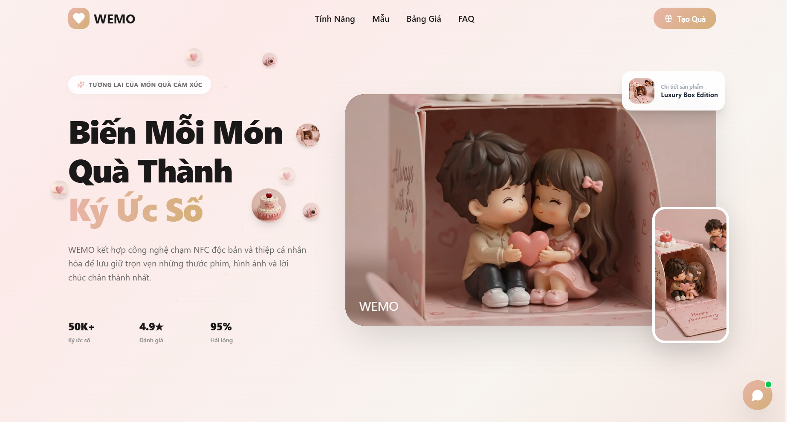

# WEMO - Premium Digital NFC Gift Platform

**WEMO** là nền tảng tạo thiệp quà tặng kỹ thuật số cao cấp tích hợp chip NFC thông minh. Hệ thống cho phép người dùng cá nhân hóa trải nghiệm quà tặng bằng cách liên kết thiệp kỹ thuật số sinh động (chứa hình ảnh, lời chúc, nhạc nền và các tính năng tương tác độc đáo) vào một chiếc thẻ/quà tặng vật lý gắn chip NFC.

Khi người nhận chạm nhẹ điện thoại vào thẻ, thiệp quà tặng sẽ được tự động mở ra trên màn hình với hiệu ứng âm thanh và hình ảnh vô cùng ấn tượng.


---

## 🧭 Luồng Hoạt Động (User Journey)

1. **Nhận Thẻ vật lý**: Người mua nhận được quà tặng/thẻ WEMO có gắn chip NFC kèm theo một **Mã Đơn Hàng (Order ID)** duy nhất.
2. **Kích hoạt & Thiết kế (Gift Wizard)**:
   - Truy cập vào trang tạo thiệp, nhập **Order ID** hợp lệ để bắt đầu.
   - Mỗi Order ID chỉ cho phép thiết kế **1 lần duy nhất** (các lần sau quét sẽ chỉ hiển thị xem lại link thiệp đã tạo).
   - Chọn chủ đề và mẫu thiết kế ưa thích.
   - Tải lên ảnh thực tế, viết lời chúc, chọn nhạc nền (piano, lãng mạn, sinh nhật...).
3. **Ghi liên kết vào thẻ NFC**: Hệ thống lưu dữ liệu thiệp xuống Server, sinh ra mã link thiệp động và mã QR. Người dùng sử dụng điện thoại để ghi liên kết này vào thẻ chip NFC.
4. **Nhận Quà**: Người nhận chạm điện thoại vào thẻ vật lý để mở ra giao diện thiệp chuyển động tuyệt đẹp.

---

## ✨ Các Tính Năng Nổi Bật

### 1. 6 Mẫu Thiệp (Templates) Thiết Kế Độc Quyền & Đẹp Mắt

- **BirthdayLuxury (Sinh Nhật Hoàng Gia)**: Tông màu đen - vàng gold quý phái, vương miện xoay 3D, nút 🥂 _Khai tiệc Champagne_ sủi bọt khí bay lên và **Sổ Vàng Lời Chúc VIP** để ghi nhận lời chúc của khách mời.
- **LoveRomantic (Tình Yêu Lãng Mạn)**: Thiết kế kính mờ (Glassmorphic) hiện đại trên nền hồng phấn lãng mạn, hiệu ứng trái tim bay rụng động và nút đếm lượt yêu thương.
- **AnniversaryTimeline (Hành Trình Kỷ Niệm)**: Thiết kế dạng timeline dòng thời gian cổ điển trên nền giấy thô, trình chiếu các bức ảnh polaroid kỉ niệm cuộn dọc tinh tế.
- **ChristmasCozy (Giáng Sinh Ấm Áp)**: Tông màu đỏ nhung và xanh lục bảo, hiệu ứng tuyết rơi bay nhẹ và trang trí cây thông sinh động.
- **BirthdayMinimal (Tối Giản Bắc Âu)**: Cành lá vẽ nét thanh mảnh, cắm hoa nghệ thuật, thiết kế nhẹ nhàng, thư thái.
- **BirthdayRetro (Game Boy 8-Bit Cổ Điển)**: Mô phỏng chiếc máy chơi game cầm tay cổ điển với các nút bấm A/B tương tác đổi điểm, cần điều khiển và nhạc nền chiptune hoài niệm.

### 2. Trình Phát Nhạc Nền & Tải Ảnh Thực Tế

- Tải lên hình ảnh trực tiếp từ máy tính lưu trữ cục bộ tại máy chủ.
- Tự động phát nhạc nền phù hợp chủ đề (Piano, Romantic, Birthday) kèm theo nút tắt/mở âm lượng tiện lợi có cơ chế chống chặn tự động phát (Autoplay Safeguard) trên trình duyệt di động.

### 3. Hệ Thống Real-time Support Chat (Trò Chuyện Trực Tuyến)

- Tích hợp bong bóng chat trợ giúp khách hàng ngay trên giao diện tạo thiệp.
- Sử dụng công nghệ **Server-Sent Events (SSE)** giúp truyền nhận tin nhắn hai chiều giữa khách hàng và Admin theo thời gian thực với độ trễ <50ms (không cần Polling liên tục gây tải CPU).

### 4. Trang Quản Trị Admin Dashboard Toàn Diện

- Quản lý & Tạo mã Đơn Hàng mới (Order ID) cấp quyền cho khách hàng.
- Theo dõi các chỉ số KPI doanh thu, số thiệp đã tạo, chip NFC đã kích hoạt và lượt xem thiệp thông qua biểu đồ trực quan.
- Quản trị viên trao đổi và phản hồi chat trực tuyến trực tiếp với người dùng.
- Cấu hình cài đặt dung lượng tệp tải lên, gói dịch vụ, thông báo email và mạng xã hội.

### 5. Cơ Chế Bảo Mật & Lưu Trữ Đáng Tin Cậy

- Xác thực Admin bằng **JWT Token** có chữ ký mã hóa, mật khẩu được băm bảo mật bằng thuật toán **PBKDF2** của Node `crypto`.
- Cơ chế đọc/ghi tệp JSON bất đồng bộ kết hợp **Hàng đợi ghi (Write Queue)** giúp giải quyết triệt để vấn đề xung đột ghi đè tệp rỗng khi có nhiều thao tác ghi đồng thời.
- Hỗ trợ lưu trữ kép: Tự động kết nối **MongoDB** làm database chính, nếu không có sẽ tự động chuyển đổi sang các tệp **JSON fallback** dự phòng cục bộ để hệ thống luôn hoạt động ổn định.

---

## 📂 Cấu Trúc Thư Mục Dự Án

- `/backend`: Mã nguồn server viết bằng Node.js + ExpressJS.
  - `/models`: Định nghĩa các Mongoose schemas (Order, Gift, NFC, Message).
  - `/utils`: Thư viện băm mật khẩu, tạo token bảo mật, và bộ điều phối hàng đợi ghi tệp (storage).
  - `/data`: Lưu trữ các file JSON fallback dự phòng.
  - `/uploads`: Thư mục lưu trữ hình ảnh tải lên từ người dùng.
- `/frontend`: Giao diện người dùng viết bằng React + Vite + Tailwind CSS.
  - `/src/app/components/templates`: Chứa mã nguồn 6 mẫu thiệp kỹ thuật số.
  - `/src/app/components/admin`: Chứa mã nguồn các trang quản trị Admin.
  - `/src/app/pages/GiftWizard.tsx`: Trình tạo thiệp 5 bước dành cho người dùng.

---

## 🛠️ Hướng Dẫn Cài Đặt & Chạy Dự Án

### 1. Cấu hình Backend

Di chuyển vào thư mục backend và cài đặt thư viện:

```bash
cd backend
npm install
```

Tạo file `.env` tại thư mục `/backend` với nội dung cấu hình:

```env
PORT=5000
MONGO_URI=your_mongodb_connection_string
```

_(Nếu không điền MONGO_URI hoặc kết nối lỗi, hệ thống sẽ tự động dùng JSON Database dự phòng)_

Tiến hành seed dữ liệu mẫu để khởi tạo database:

```bash
node seed.js
```

Khởi chạy server backend:

```bash
npm run dev
```

_(Backend sẽ chạy ở cổng `http://localhost:5000`)_

### 2. Cấu hình Frontend

Mở một terminal mới, di chuyển vào thư mục frontend và cài đặt thư viện:

```bash
cd frontend
npm install
```

Khởi chạy server development:

```bash
npm run dev
```

_(Frontend sẽ chạy ở cổng `http://localhost:5173` và tự động kết nối proxy API tới backend ở cổng `5000`)_

### 🔑 Thông tin Đăng Nhập Trang Admin (`/admin`):

- **Tên đăng nhập**: `admin`
- **Mật khẩu**: `admin123`
